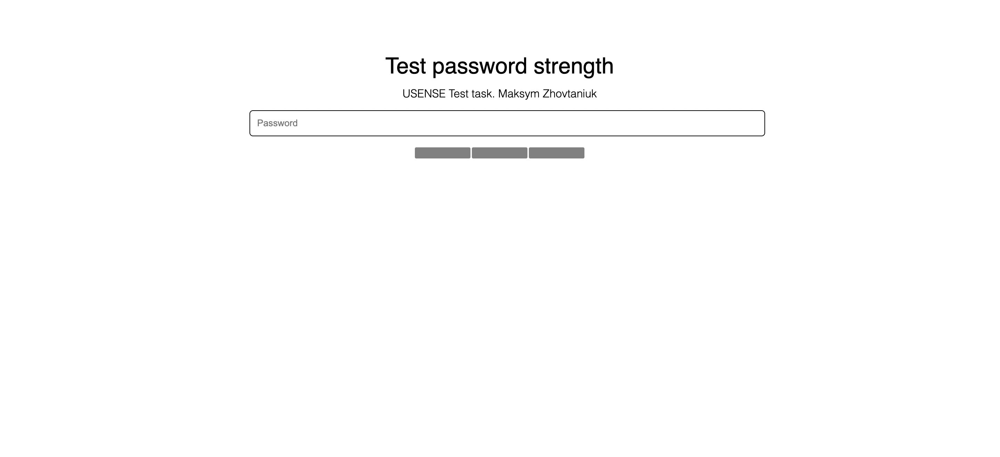

# USENSE Test Task
### Test password strength

This project was generated with [Angular CLI](https://github.com/angular/angular-cli) version 15.1.5.

### Install dependencies
```shell
npm install
```

### Development server

Run `ng serve` for a dev server. Navigate to `http://localhost:4200/`. The application will automatically reload if you change any of the source files.

---


